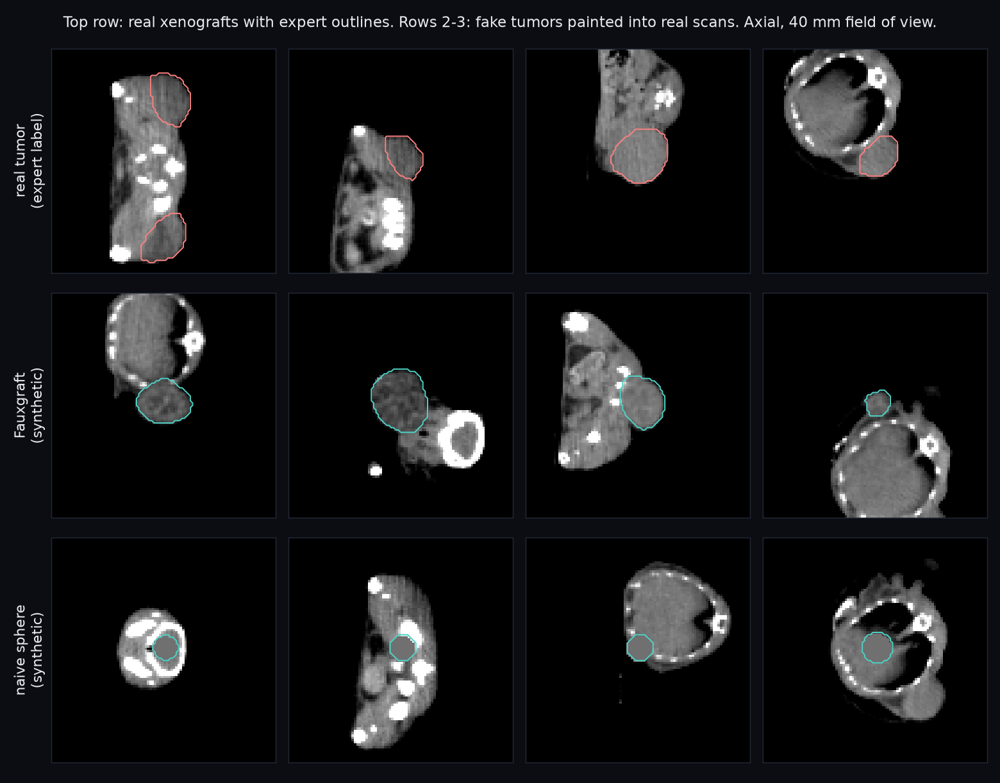
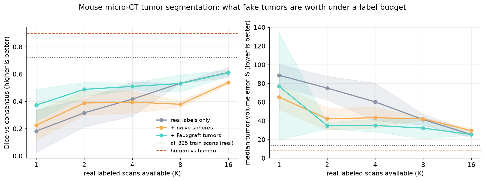
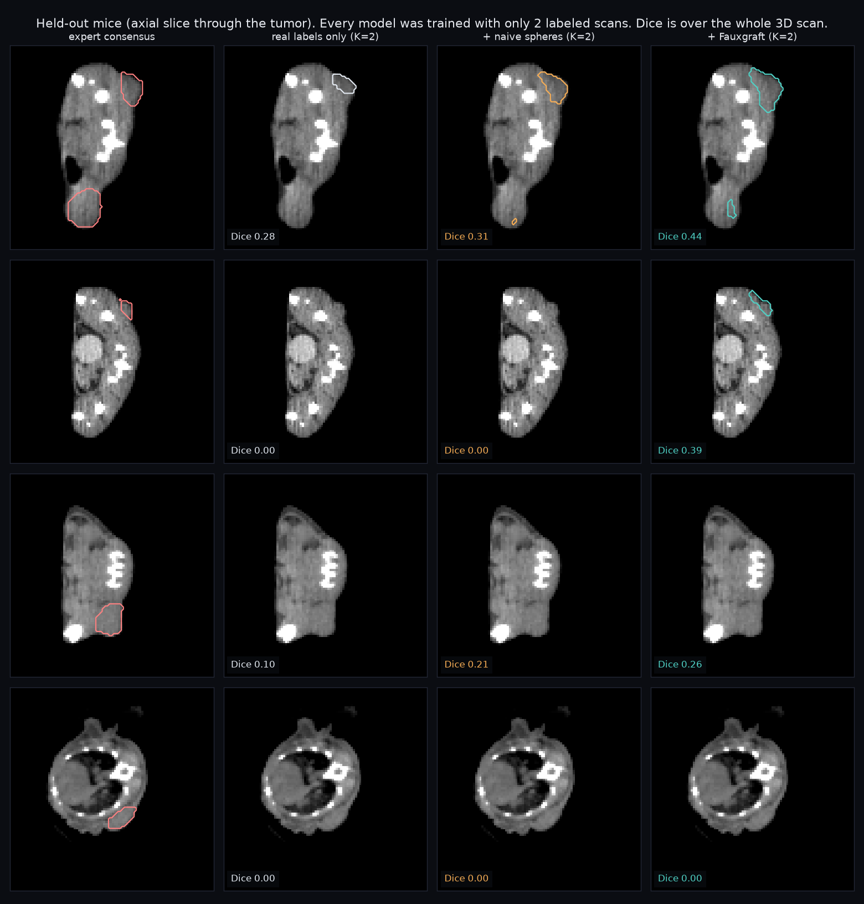

# Fauxgraft

**Painting realistic fake tumors into real mouse CT scans, to train a tumor segmenter when you only have a handful of hand-labeled scans.**

In preclinical imaging, the slow part isn't scanning. It's an expert outlining every tumor in 3D by hand so a model can learn from it. Fauxgraft makes synthetic subcutaneous xenografts and pastes them into real micro-CT scans. Each fake is lumpy, bulges out of the flank, and has tissue texture matched to the real tumors. Then it asks one question: **how many hand labels is that worth?**



## Result

**With only 1 or 2 hand-labeled scans, adding Fauxgraft tumors was worth about 3x the labels.** A model trained on 2 labeled scans plus fakes reached Dice 0.49 on 114 held-out scans, which is about what roughly 6 real labeled scans would get. The same 2 scans alone got 0.32 (paired difference +0.17, 95% CI 0.15 to 0.20, 3 seeds). Median tumor-volume error, the number a biologist actually puts on a graph, dropped from 75% to 35%. Fauxgraft beat real labels alone in every seed at K = 1 and K = 2.

The benefit fades as real labels grow: +0.19 Dice at K = 1, +0.17 at K = 2, +0.09 at K = 4, and nothing at K = 8 or 16, where the confidence intervals straddle zero. **So Fauxgraft is a cold-start tool. It speeds up the first few labeled mice, not the last.**



| real labeled scans (K) | real only: Dice / median vol. error | + naive spheres | + Fauxgraft | Fauxgraft is worth about this many real labels |
|---|---|---|---|---|
| 1 | 0.18 ± 0.16 / 89% | 0.23 ± 0.11 / 65% | **0.37 ± 0.12** / 77% | 3.0 |
| 2 | 0.32 ± 0.10 / 75% | 0.39 ± 0.09 / 42% | **0.49 ± 0.05** / **35%** | 6.1 |
| 4 | 0.42 ± 0.13 / 60% | 0.40 ± 0.08 / 43% | **0.51 ± 0.03** / **35%** | 7.0 |
| 8 | 0.53 ± 0.00 / 41% | 0.38 ± 0.02 / 42% | 0.53 ± 0.06 / 32% | 7.9 |
| 16 | 0.61 ± 0.04 / 25% | 0.54 ± 0.01 / 30% | 0.61 ± 0.02 / 25% | 15.6 |
| all 325 training scans | 0.72 / 14% | | | |
| human vs human | 0.90 / 8% | | | |

Mean ± sd across seeds. Dice is against the 3-expert STAPLE consensus on 114 held-out scans from 55 unseen mice. "Worth about this many real labels" interpolates the real-only Dice curve in log2(K). Paired per-scan bootstrap CIs for every comparison, and the same table after a 10 mm³ blob-size filter, are in `results/summary.json`. The filter changes no conclusion.



### Why the naive baseline matters
The naive arm pastes perfect constant-intensity spheres at random points inside the body. That's what "just add synthetic data" usually means. It's in the experiment to test whether *realism* is doing the work, or whether any extra positives would help. It barely helps (+0.04 Dice at K = 1, +0.07 at K = 2), makes no difference at K = 4 (−0.02, CI −0.05 to +0.01), and then actively hurts: −0.15 at K = 8 (CI −0.19 to −0.12) and −0.07 at K = 16. Fauxgraft beats naive at every budget, by +0.07 to +0.15. Perfect spheres in the wrong places teach the model the wrong idea of what a tumor is. Once there are enough real labels to learn the right idea, those fakes just get in the way.

## The experiment

- **Data:** the public TumSeg database (Jensen et al., *Sci Data* 2024, CC-BY): 452 whole-body mouse micro-CT scans, 223 mice, every tumor outlined independently by 3 experts plus a STAPLE consensus. 439 scans are usable here: 13 have filenames that drop the ".5" from "22.5h" and don't match their folders. Downsampled 2x to 0.42 mm so everything trains on a laptop CPU.
- **Split by mouse:** 55 mice (114 scans) are held out for testing. No mouse appears in both train and test, since longitudinal scans of the same mouse are near-duplicates.
- **Label budget K** ∈ {1, 2, 4, 8, 16}: the model gets K labeled scans, each from a different mouse. The seed decides *which* mice. 3 seeds at K ≤ 4, 2 seeds at K = 8 and 16 (compute budget), plus a reference trained on all 325 training scans.
- **Three arms, identical everything else:** same 3D U-Net (0.6M params), same 2,500 iterations, same share of tumor-centered patches. Only the tumors differ:
  - `real`: only the K real labeled scans
  - `naive`: K real scans + spheres pasted on the fly
  - `fauxgraft`: K real scans + realistic fakes pasted on the fly
- **Fakes are only pasted into the K labeled training scans**, away from their real tumors, so the label budget is honest: no extra real annotations, and nothing is pasted into test scans. Fake-tumor intensity statistics come only from those same K labeled tumors.
- **Metrics on held-out scans:** Dice vs the expert consensus, lesion recall (fraction of real tumors found), false-positive blobs, and the number a biologist actually uses, tumor-volume error. The yardstick is human vs human agreement on the same scans: two experts outlining the same tumor agree at Dice 0.90, with an 8% median volume difference.

### How a Fauxgraft tumor is made (`fauxgraft/synth.py`)
1. Find the skin surface of the trunk (largest body component, middle 50% of body length), at least 4 mm from any real tumor.
2. Pick a volume log-uniformly from 30 to 1,500 mm³ (the real range here is roughly 14 to 3,800).
3. Build an ellipsoid with random axes and rotation, then roughen the surface with smoothed noise so it's lumpy rather than spherical.
4. Push the center outward along the skin normal so most of it bulges out of the body, like a real flank xenograft.
5. Fill it with soft-tissue intensity and texture matched to the real labeled tumors, plus a slightly darker core on large ones, and blend the edge over about one voxel to imitate partial-volume blur.

## Honesty notes
- **Small number of seeds:** 3 at K ≤ 4, 2 at K = 8 and 16, and 1 all-data reference, because of compute. Which mice happen to be labeled matters a lot at tiny K: real-only at K = 1 ranged from Dice 0.04 to 0.35 across seeds. That's why the main comparisons are paired per held-out scan, with bootstrap CIs.
- **Extra false positives:** fake-trained models produce more stray blobs at low K (6.0 per scan vs 1.3 for real-only at K = 2). A 10 mm³ size filter cuts that to 3.8 vs 0.7 without changing Dice. The threshold comes from a dataset fact, not test tuning: 565 of 570 consensus tumor components are larger. Stray blobs are also a general weakness of this small CPU-trained model: the all-data model averages 9 per scan, and in ScanSpeak's 3D view it fires on the chest and a knee.
- **The fakes protrude more than real tumors.** On a cylinder phantom, about 82% of a fake's volume sits outside the body. Real xenografts in these scans are more embedded (see the gallery). Matching that more closely is the obvious next improvement.
- **This is a controlled comparison, not a state-of-the-art claim.** It uses 0.42 mm downsampling, a 0.6M-parameter U-Net and 2,500 CPU iterations, so absolute Dice isn't comparable to full-resolution, GPU-trained models. What matters is the gap between arms trained identically.
- **One generator, no tuning against test results.** The volume range, bulge and texture rules were set from how flank xenografts look and from the labeled training tumors. Only that version was ever run.
- **The "real-label equivalent"** is interpolated from a noisy real-only curve, so read it as approximate (about 3x at K ≤ 2), not exact.
- 13 of 452 scans were skipped because their filenames drop the ".5" in "22.5h".

## Reproduce

```bash
pip install -r requirements.txt
bash scripts/get_data.sh data             # 2.2 GB download + preprocessing
export FAUXGRAFT_DATA=data/npz
python3 -u scripts/sweep.py --workers 4 --threads 4    # about 2.5 h on an 18-core laptop CPU, writes runs/
python3 scripts/reeval.py && python3 scripts/analyze.py   # analyze.py also works from the committed results/runs
python3 scripts/gallery.py && python3 scripts/compare_figure.py
```

A single run: `python3 -m fauxgraft.train --k 2 --arm fauxgraft --seed 0`.

## Explaining it in 30 seconds

"Training a tumor segmenter for mouse CT normally needs experts to hand-outline tumors in 3D, and that's the bottleneck. I built a generator that paints realistic fake tumors into real scans: they sit on the flank, bulge outward, and have matching texture. Then I measured what that's worth. With only two hand-labeled scans, adding the fakes got the model to roughly where six real labeled scans would, so about three times the labels for free, and it cut tumor-volume error from 75% to 35%. Once you have about eight labeled scans, the fakes stop adding anything, so it's a cold-start tool. Pasting simple spheres instead helped a little when labels were very scarce and hurt once there were enough, so it's the realism that matters, not just having more examples."

Companion project: [ScanSpeak](https://github.com/Mohith26/scanspeak), a natural-language interface to the same scans that uses a Fauxgraft-trained model as its tumor tool.
